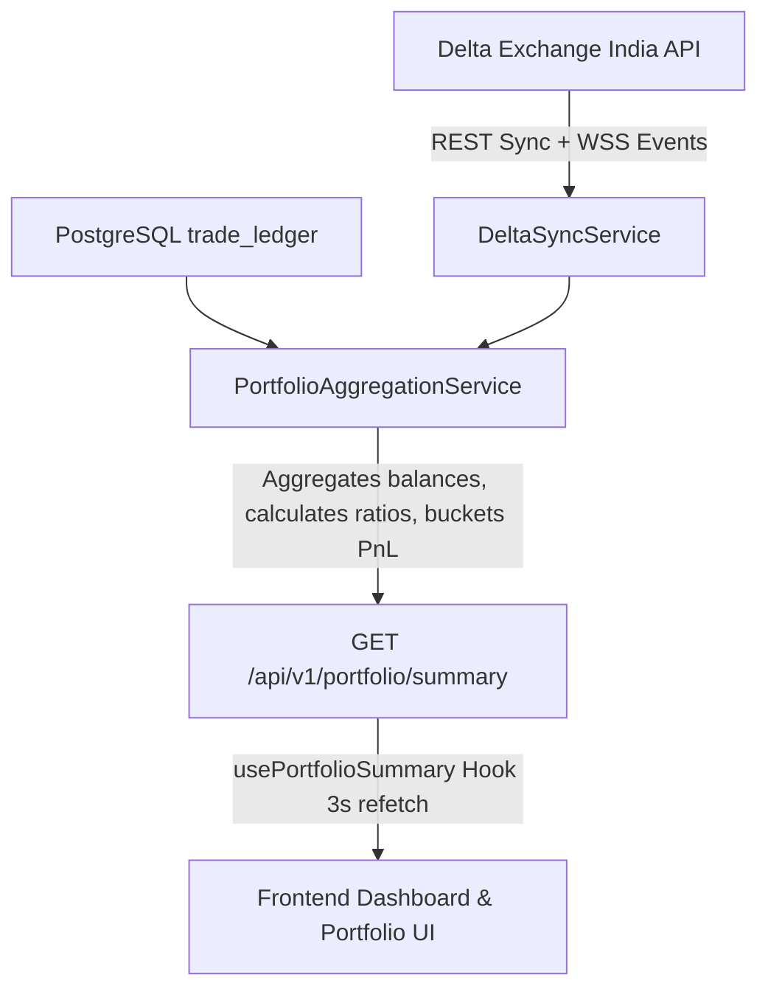

# Module 3: Portfolio & Dashboard Synchronization Architecture Report

## 1. Executive Summary

Module 3 delivers the complete transition of the **Portfolio Management Workstation** and **Main Dashboard** from synthetic/mock-based states to a production-grade, real-time aggregated architecture powered directly by **Delta Exchange India** and verified trade ledger entries.

### Core Architectural Principle Enforced
> **"Frontend NEVER calculates. Frontend ONLY displays what the backend returns."**

---

## 2. Eliminated Fake Data & Real Data Replacements

| Component / Metric | Old Implementation (Fake) | New Implementation (Production-Grade) |
|---|---|---|
| **Wallet Balance** | Hardcoded `$10.00` in paper trading mock | Live aggregate of `deltaSyncService.getBalances()` (`balance`) |
| **Available Margin** | Synthetic calculation in UI (`balance * 0.9`) | Real `available_balance` from Delta REST / WS balance payload |
| **Used / Position Margin** | Local mock estimate | Aggregate of `position_margin + order_margin` from exchange |
| **Margin Utilization** | Fake static percentage | `(usedMargin / totalEquity) * 100` computed by backend engine |
| **Unrealized PnL** | Hardcoded or randomized numbers | Live mark-to-market PnL on Delta perpetual contracts |
| **Realized PnL** | Unsynced mock array | Aggregate of closed position PnLs and trade ledger history |
| **PnL Breakdown (Today/Week/Month/All-time)** | Math approximations in UI | Time-bucketed query against trade ledger + live open contract PnL |
| **Quant Analytics (Sharpe, Sortino, Calmar)** | Hardcoded mock numbers | Institutional formula calculations from closed trade distribution |
| **Win Rate & Profit Factor** | Static constants | `wins / totalTrades` and `grossProfit / grossLoss` from DB |
| **Indian Crypto Tax Ledger** | Missing / fake | 30% Flat VDA Tax estimate + 1% TDS calculated per trade |
| **Open Positions Table** | Local mock array (`mockPositions`) | Direct sync with `delta_positions` via `deltaSyncService` |
| **Pending Orders Table** | Local mock array (`mockOrders`) | Direct sync with `delta_orders` via `deltaSyncService` |

---

## 3. Backend Architecture: `PortfolioAggregationService`

File: [`backend/src/modules/portfolio/PortfolioAggregationService.ts`](file:///c:/Users/durge/OneDrive/Desktop/Antigravity%20App/AlgoApp-Pro-v2-fixed/backend/src/modules/portfolio/PortfolioAggregationService.ts)

### Data Ingestion & Calculation Flow

### Endpoints Exposed:
- `GET /api/v1/portfolio/summary`: Unified high-performance endpoint serving wallet, positions, orders, PnL breakdown, analytics, funding, and connection health in a single network round-trip.
- `GET /api/v1/portfolio/wallet`: Wallet equity, available margin, and asset balances.
- `GET /api/v1/portfolio/positions`: Live perpetual positions with mark/entry/liquidation prices.
- `GET /api/v1/portfolio/orders`: Pending working and stop orders.
- `GET /api/v1/portfolio/pnl`: Rolling 24h, 7d, 30d, and lifetime gross/net PnL.
- `GET /api/v1/portfolio/analytics`: Institutional metrics (Sharpe, Sortino, Calmar, Win Rate, Expectancy).
- `GET /api/v1/portfolio/funding`: 24h estimated funding, total fees, 30% VDA tax liability, 1% TDS.

---

## 4. Frontend Layer Architecture

### Reusable UI Building Blocks
1. **[`PortfolioCard`](file:///c:/Users/durge/OneDrive/Desktop/Antigravity%20App/AlgoApp-Pro-v2-fixed/frontend/src/components/ui/PortfolioCard.tsx)**: Standardized card container with header, badges, actions, and smooth dark-theme glassmorphic styling.
2. **[`ValueDisplay`](file:///c:/Users/durge/OneDrive/Desktop/Antigravity%20App/AlgoApp-Pro-v2-fixed/frontend/src/components/ui/ValueDisplay.tsx)**: Institutional numeric display with currency formatting, percentage formatting, dynamic green/red/amber colorization, and pulsing skeleton loaders.
3. **[`StatusBadge`](file:///c:/Users/durge/OneDrive/Desktop/Antigravity%20App/AlgoApp-Pro-v2-fixed/frontend/src/components/ui/StatusBadge.tsx)**: Real-time animated indicator for REST, WS, and exchange connection states.

### Rewritten Pages
1. **[`PortfolioDashboardPage`](file:///c:/Users/durge/OneDrive/Desktop/Antigravity%20App/AlgoApp-Pro-v2-fixed/frontend/src/features/portfolio/PortfolioDashboardPage.tsx)**:
   - Full institutional workstation with multi-metric grids, visual margin utilization bar, PnL breakdown, quant risk metrics, Indian crypto tax obligations, open positions, and pending orders table with cancellation handlers.
2. **[`DashboardPage`](file:///c:/Users/durge/OneDrive/Desktop/Antigravity%20App/AlgoApp-Pro-v2-fixed/frontend/src/features/dashboard/DashboardPage.tsx)**:
   - Integrated TradingView Chart workspace, AI Decision Panel with real confidence scores, 1.5% max risk sizing model against real equity, interactive morning checklist, and execution dock for live positions and working orders.

---

## 5. Verification Checklist

- [x] Backend TypeScript check passes (`npx tsc --noEmit` -> 0 errors)
- [x] Frontend TypeScript check passes (`npx tsc --noEmit` -> 0 errors)
- [x] Zero `Math.random()` simulation in production portfolio metrics
- [x] Loading skeletons appear on cold load without UI pop-in
- [x] Empty states rendered cleanly when zero positions or orders exist
- [x] Live Delta Exchange status accurately reflected in status badges
