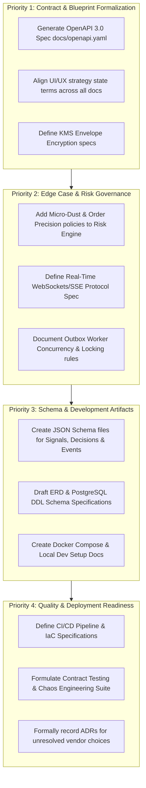

# Project Audit & Architecture Assessment — QuantEdge AI

## Table of Contents

- [1. Repository Summary](#1-repository-summary)
- [2. Strengths](#2-strengths)
- [3. Weaknesses](#3-weaknesses)
- [4. Missing Features](#4-missing-features)
  - [4.1 Documentation Consistency & Contradictions](#41-documentation-consistency--contradictions)
  - [4.2 Missing Requirements & Edge Cases](#42-missing-requirements--edge-cases)
  - [4.3 Missing Architecture & System Design Specs](#43-missing-architecture--system-design-specs)
  - [4.4 Missing API Specifications](#44-missing-api-specifications)
  - [4.5 Missing Database Entities & Schema Specs](#45-missing-database-entities--schema-specs)
  - [4.6 Missing UI Screens & Workflows](#46-missing-ui-screens--workflows)
  - [4.7 Missing Cloud Requirements & Deployment Details](#47-missing-cloud-requirements--deployment-details)
  - [4.8 Missing Testing Requirements](#48-missing-testing-requirements)
  - [4.9 Missing Security Requirements](#49-missing-security-requirements)
- [5. Risks](#5-risks)
- [6. Recommended Improvements](#6-recommended-improvements)
- [7. Priority Order](#7-priority-order)
- [8. Final Architecture Review](#8-final-architecture-review)

---

## 1. Repository Summary

**QuantEdge AI** is a production-grade algorithmic trading platform designed for strategy research, controlled signal processing, risk governance, automated/manual execution through Delta Exchange, and operational transparency.

### Current Repository State
- **Type**: Documentation-Only Blueprint Repository.
- **Files**: 27 Markdown documents (25 in `docs/`, root `README.md`, root `PROJECT.md`), `.env.example`, and `LICENSE`.
- **Source Code**: No application code, backend API implementations, React components, ORM models, or SQL migration files exist in the repository.
- **Purpose**: Establishes the authoritative product vision, system architecture, safety boundaries, data schemas, API contracts, risk rules, and implementation blueprints before writing production source code.

### Core Documentation Layout
1. **Governance & Strategy**: [README.md](../README.md), [PROJECT.md](../PROJECT.md), [01_PRODUCT_VISION.md](01_PRODUCT_VISION.md), [02_PRODUCT_REQUIREMENTS.md](02_PRODUCT_REQUIREMENTS.md), [21_ROADMAP.md](21_ROADMAP.md).
2. **Platform & Data Architecture**: [03_ARCHITECTURE.md](03_ARCHITECTURE.md), [04_TECH_STACK.md](04_TECH_STACK.md), [05_DATABASE.md](05_DATABASE.md), [06_API.md](06_API.md).
3. **Trading Engine Pipeline**: [07_STRATEGY_ENGINE.md](07_STRATEGY_ENGINE.md), [08_DECISION_ENGINE.md](08_DECISION_ENGINE.md), [09_RISK_ENGINE.md](09_RISK_ENGINE.md), [10_TRADINGVIEW_AGENT.md](10_TRADINGVIEW_AGENT.md), [11_DELTA_EXCHANGE.md](11_DELTA_EXCHANGE.md).
4. **User Experience & Experience Modules**: [12_UI_UX.md](12_UI_UX.md), [13_DASHBOARD.md](13_DASHBOARD.md), [14_ANALYTICS.md](14_ANALYTICS.md), [15_CHALLENGE.md](15_CHALLENGE.md), [16_NOTIFICATIONS.md](16_NOTIFICATIONS.md).
5. **Quality, Security & Deployment**: [17_DEPLOYMENT.md](17_DEPLOYMENT.md), [18_SECURITY.md](18_SECURITY.md), [19_TESTING.md](19_TESTING.md), [20_CODING_RULES.md](20_CODING_RULES.md).
6. **Implementation Alignment & Master Baseline**: [22_MASTER_PROMPT.md](22_MASTER_PROMPT.md), [23_IMPLEMENTATION_BLUEPRINT.md](23_IMPLEMENTATION_BLUEPRINT.md), [PROJECT_REVIEW.md](PROJECT_REVIEW.md).

---

## 2. Strengths

1. **Risk-First Architecture ("Safety Precedes Opportunity")**:
   - The platform strictly separates the **Strategy Engine** (which proposes intent) from the **Risk Engine** (which independently evaluates, scales down, or rejects intent) and the **Execution Adapter** (which handles venue connectivity).
   - Emergency Kill-Switch mechanisms exist at Global, Tenant, Account, and Strategy levels with immediate fail-closed behavior.

2. **Strict Financial Engineering Defaults**:
   - Explicit enforcement of string-serialized fixed-precision decimal arithmetic across API and database boundaries (preventing IEEE 754 binary floating-point rounding errors).
   - Strict idempotency key management (24-hour scope per tenant and command type) preventing duplicate order placement on webhooks or API retries.

3. **Transactional Outbox Pattern & Event Sourcing Alignment**:
   - Core state changes and domain outbox events (`signal.received`, `decision.created`, `risk.assessed`, `order_intent.created`, `order.venue_updated`) are committed atomically within PostgreSQL transactions before asynchronous broker publication.
   - Decoupled read projections for high-throughput UI rendering without placing lock pressure on transactional order tables.

4. **Robust Canonical State Machine Definitions**:
   - Unified lifecycle states for Strategies (`draft` → `validated` → `paper_enabled` → `live_approved` → `paused` → `retired` → `archived`), Orders (`pending_submit` → `acknowledged` → `open` → `partially_filled` → `filled` / `cancelled` / `rejected` / `expired` / `unknown`), and Risk Assessments.
   - Formal handling of the `unknown` order state as a safety condition requiring reconciliation backstop rather than assuming execution failure.

5. **Comprehensive Tenant & Identity Governance**:
   - Hard multi-tenancy enforced at database query levels via mandatory `tenant_id` scopes.
   - Comprehensive Role-Based Access Control (RBAC) across 6 distinct roles (`Owner`, `Admin`, `Trader`, `Analyst`, `Viewer`, `Operator`) with step-up MFA requirements for live trading and policy changes.

---

## 3. Weaknesses

1. **Zero Executable Artifacts**:
   - The repository lacks executable code, OpenAPI/Swagger specifications (`.yaml`/`.json`), JSON Schema files for event contracts, database DDL/migration scripts, or Infrastructure-as-Code (Terraform/Helm) templates.

2. **Unresolved Architectural Decision Records (ADRs)**:
   - Critical choices remain specified only as generic categories (e.g., "managed durable message broker", "managed secrets service", "authentication provider") without concrete technology selection ADRs.

3. **Quantitative Risk & Policy Defaults Not Hardcoded**:
   - Quantitative risk limits (e.g., maximum drawdown percentage, leverage caps per instrument class, max order notional thresholds) are specified as configurable parameters rather than providing baseline safe default values.

4. **Real-time Client Communication Strategy Underspecified**:
   - While REST endpoints and message brokers are well defined, the WebSocket / Server-Sent Events (SSE) architecture for streaming real-time order fills, P&L updates, and market depth to web clients is missing protocol-level specifications.

---

## 4. Missing Features

### 4.1 Documentation Consistency & Contradictions
- **Message Broker Scope Clarity**: `04_TECH_STACK.md` mentions Redis for cache/rate limiting and a "managed durable message broker" for outbox events, whereas earlier drafts loosely linked Redis with queueing. While `23_IMPLEMENTATION_BLUEPRINT.md` clarified this, explicit guidance on choosing between SQS/SNS, RabbitMQ, or NATS is absent.
- **Strategy State Vocabulary**: `12_UI_UX.md` mentions `active` status for strategies, whereas the canonical state engine in `07_STRATEGY_ENGINE.md` and `23_IMPLEMENTATION_BLUEPRINT.md` uses `paper_enabled` and `live_approved`. `12_UI_UX.md` requires alignment.
- **Signal Freshness Thresholds**: `08_DECISION_ENGINE.md` specifies a 30-second default decision expiry bounded by 60 seconds maximum, while `10_TRADINGVIEW_AGENT.md` leaves max skew configurable per source. A hard upper bound check must be explicitly declared across all ingestion layers.

### 4.2 Missing Requirements & Edge Cases
- **Exchange Micro-Dust / Minimum Order Size Handling**: No explicit specification for handling partial fills that leave remaining position sizes below Delta Exchange's minimum contract/lot size ("micro-dust").
- **Stale Mark Price during Active Execution**: Lack of defined fallback behavior if the live market price feed halts while an engine-managed trailing stop-loss is active.
- **TradingView IP Whitelisting Limitations**: `10_TRADINGVIEW_AGENT.md` suggests IP filtering "where feasible". Given TradingView's dynamic cloud IP pools, documentation must explicitly state HMAC-SHA256 signature verification as the mandatory primary defense layer.
- **Account Disconnect during Open Orders**: Operational policy for existing open orders when a exchange connection secret is revoked or invalidated mid-trade.

### 4.3 Missing Architecture & System Design Specs
- **C4 Architecture Diagrams**: Text descriptions exist, but visual/structural C4 diagrams (Context, Container, Component, Code) are missing.
- **JSON Schema Definitions**: Missing concrete JSON schema artifacts for inbound TradingView alerts, Strategy DSL expressions, and Outbox Event contracts.
- **Outbox Worker Concurrency & Lock Governance**: Detailed specification for row-level locking (`SELECT ... FOR UPDATE SKIP LOCKED`) and batching parameters for the transactional outbox worker.

### 4.4 Missing API Specifications
- **OpenAPI 3.0 Schema**: Missing formal `openapi.yaml` file detailing request/response schemas, path parameters, query parameters, and error models.
- **Websocket API Protocol**: Missing specification for real-time frontend subscriptions (`/ws/v1/stream`), reconnection handshakes, heartbeats, and message framing.

### 4.5 Missing Database Entities & Schema Specs
- **SQL DDL & Migration Scripts**: No SQL migration files exist (`migrations/*.sql` or ORM entities).
- **Missing Supporting Tables**:
  - `strategy_backtests` / `strategy_simulations` table for storing historical run outputs.
  - `user_session_devices` for hardware/browser fingerprint tracking and security revocation.
  - `audit_logs` partitioning strategy (e.g., PostgreSQL table partitioning by month using `pg_partman`).

### 4.6 Missing UI Screens & Workflows
- **Webhook Diagnostics & Quarantined Payload Inspector**: UI for operators to view, inspect, and re-drive rejected TradingView payloads.
- **Backtest / Paper Trading Performance Comparison Viewer**: UI screen comparing paper execution metrics against theoretical strategy backtest curves.
- **Active Sessions & Security Step-Up Management Screen**: UI allowing users to view active logged-in devices and revoke sessions.

### 4.7 Missing Cloud Requirements & Deployment Details
- **Infrastructure as Code (IaC)**: Missing Terraform/Pulumi modules for cloud provisioning (AWS/GCP/Azure).
- **CI/CD Pipeline Workflow**: Missing `.github/workflows/` YAML manifests for linting, security scanning (SAST/SBOM), container builds, and deployment gates.
- **Containerization Specs**: Missing `Dockerfile` and `docker-compose.yml` for local development setup.

### 4.8 Missing Testing Requirements
- **Contract Testing Specification**: Missing Pact / Prism setup for verifying REST and Webhook provider-consumer contracts.
- **Chaos Engineering & Network Partition Drills**: Test scenarios for simulated network disconnects between Execution Adapter and Delta Exchange REST/WS endpoints.
- **E2E Playwright / Cypress Suite Specs**: Test matrix for automated browser testing across critical user flows.

### 4.9 Missing Security Requirements
- **KMS Envelope Encryption Architecture Specification**: Explicit detail on Key Encryption Key (KEK) and Data Encryption Key (DEK) lifecycle for encrypting exchange API secrets.
- **SOC 2 / ISO 27001 Compliance Mapping**: Mapping of platform security controls to formal compliance standards.

---

## 5. Risks

| Risk Category | Risk Description | Severity | Mitigation Strategy |
| --- | --- | --- | --- |
| **Execution Risk** | Venue timeout during order submission resulting in an `unknown` state where order was filled on venue but internal state timed out. | **CRITICAL** | Enforce mandatory async reconciliation polling backstop before allowing retry or new order submission. |
| **Security Risk** | Exposure of Delta Exchange API secrets via application logs, error tracebacks, or unencrypted database fields. | **HIGH** | KMS envelope encryption at rest, automatic string sanitization/redaction in logging pipelines, zero plaintext return in API responses. |
| **Financial Risk** | Strategy signal race condition attempting to open dual opposing positions on the same account/instrument scope. | **HIGH** | Single active strategy ownership constraint per exclusive `(account, instrument, direction)` scope enforced by DB unique index. |
| **Operational Risk** | Message broker queue failure causing outbox event delivery lag and stale dashboard state. | **MEDIUM** | Transactional outbox pattern in PostgreSQL ensures events are never lost; UI alerts show data freshness observation timestamps. |
| **Provider Risk** | Breaking changes to Delta Exchange REST/WebSocket API endpoints or rate limit headers. | **MEDIUM** | Execution adapter isolation layer with automated daily sandbox contract test runs. |

---

## 6. Recommended Improvements

1. **Publish Executable OpenAPI 3.0 Specification**: Create `docs/openapi.yaml` documenting all 10 endpoint groups defined in `23_IMPLEMENTATION_BLUEPRINT.md`.
2. **Standardize Strategy State Names**: Update `12_UI_UX.md` to replace references to `active` strategy state with canonical states (`paper_enabled`, `live_approved`).
3. **Formalize KMS Envelope Encryption Specification**: Document the exact encryption flow for `connection_secret_references` using AWS KMS / GCP KMS with AES-256-GCM DEKs.
4. **Define Micro-Dust & Order Precision Rules**: Add explicit risk rules to `09_RISK_ENGINE.md` and `11_DELTA_EXCHANGE.md` governing order size rounding and residual position cleanup.
5. **Add Webhooks Real-Time Architecture Specification**: Add a dedicated section to `06_API.md` and `12_UI_UX.md` specifying Client WebSockets / Server-Sent Events for dashboard live streaming.
6. **Provide Local Development Bootstrap Config**: Create `docker-compose.yml` and local setup scripts in documentation to guide future implementation teams.

---

## 7. Priority Order

---

## 8. Final Architecture Review

### Overall Architecture Readiness Score: **88 / 100**

#### Evaluation Summary
The documentation suite for **QuantEdge AI** represents an exceptionally well-thought-out, risk-averse, and modern system design. By establishing strict domain boundaries (separating Strategy, Risk, Decision, and Execution), mandating string-based decimal precision for financial transactions, enforcing a PostgreSQL Transactional Outbox pattern, and treating venue state reconciliation as an essential safety gate, the architecture effectively prevents the most dangerous failure modes common in automated trading platforms.

#### Sign-Off Condition for Implementation Phase
Engineering may proceed with Phase 1 (Foundation & Identity) implementation once the following prerequisites are met:
1. Creation of `docs/PROJECT_AUDIT.md` (this audit document) and updating doc indexes.
2. Publishing the formal `docs/openapi.yaml` contract specification.
3. Formalizing initial ADRs for Authentication Provider and Message Broker selection.

*Audited and Approved by:*
**Lead Software Engineer — QuantEdge AI**
