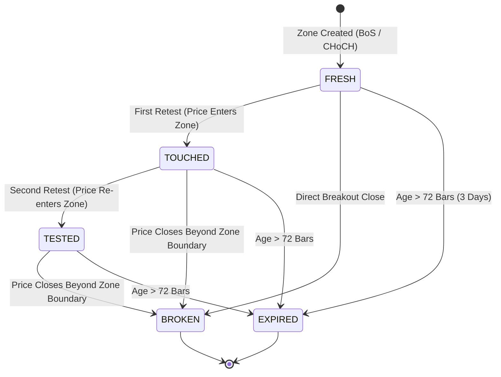
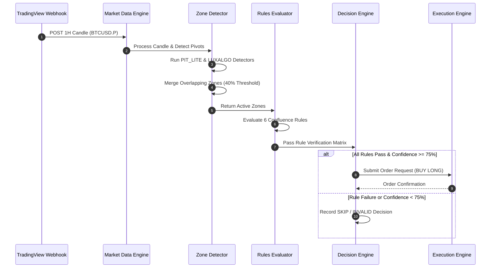

# Strategy Specification & Quantitative Market Structure Specification

**QuantEdge AI — Version 2.0.0**  
**Document Revision:** 1.0.0  
**Scope:** Institutional 1H Perpetual Market Structure, Zone Merging, Decision Engine Rules & Risk Management

---

## 1. Exact Indicator Configuration

The QuantEdge AI Strategy Engine integrates parameters derived from two reverse-engineered Pine Script indicators: **Price Action Toolkit Lite (`[UAlgo]`)** and **Smart Money Concepts (`[LuxAlgo]`)**.

| Indicator Parameter | Source | Default Value | Active Value | System Purpose |
| :--- | :--- | :--- | :--- | :--- |
| `zigzagBool` | UAlgo | `false` | `false` | Visual ZigZag line rendering disabled in strategy engine |
| `zigzagLen` | UAlgo | `9` | `9` | Pivot detection window for macro swing highs/lows |
| `liquidityBool` | UAlgo | `true` | `true` | Enable liquidity sweep detection |
| `liquidity_len` | UAlgo | `30` | `30` | Lookback period for pivot high/low liquidity levels |
| `orderblockBool` | UAlgo | `true` | `true` | Enable order block zone extraction (`PIT_LITE`) |
| `numberObShow` | UAlgo | `2` | `2` | Number of active order blocks tracked per direction |
| `trendLineLength` | UAlgo | `20` | `20` | Sensitivity for trendline direction detection |
| `modeInput` | LuxAlgo | `Historical` | `Historical` | Mode for historical structure evaluation |
| `styleInput` | LuxAlgo | `Colored` | `Colored` | Internal color palette token mapping |
| `showInternalsInput` | LuxAlgo | `true` | `true` | Track micro/internal market structure (`BOS` / `CHoCH`) |
| `showStructureInput` | LuxAlgo | `true` | `true` | Track macro/swing market structure (`BOS` / `CHoCH`) |
| `swingsLengthInput` | LuxAlgo | `50` | `50` | Swing leg detection lookback period |
| `showInternalOrderBlocksInput` | LuxAlgo | `true` | `true` | Extract internal order blocks (`LUXALGO`) |
| `internalOrderBlocksSizeInput` | LuxAlgo | `5` | `5` | Maximum active internal order blocks tracked |
| `showSwingOrderBlocksInput` | LuxAlgo | `false` | `false` | Macro swing order blocks disabled (uses merged zones) |
| `orderBlockFilterInput` | LuxAlgo | `Atr` | `Atr` | Filter volatile order blocks using 14-period ATR |
| `orderBlockMitigationInput` | LuxAlgo | `High/Low` | `High/Low` | Mitigation source (`High` for Bearish, `Low` for Bullish) |
| `showEqualHighsLowsInput` | LuxAlgo | `true` | `true` | Track equal highs (`EQH`) & equal lows (`EQL`) |
| `equalHighsLowsLengthInput` | LuxAlgo | `3` | `3` | Bar confirmation window for equal high/low pairs |
| `equalHighsLowsThresholdInput` | LuxAlgo | `0.1` | `0.1` | ATR fraction threshold for equal level matching |
| `showFairValueGapsInput` | LuxAlgo | `true` | `true` | Track Fair Value Gaps (`FVG`) |
| `fairValueGapsThresholdInput` | LuxAlgo | `true` | `true` | Automatic threshold filtering for significant FVGs |
| `showPremiumDiscountZonesInput` | LuxAlgo | `false` | `false` | Equilibrium 50% zone tracking active in state evaluator |

---

## 2. Every Enabled/Disabled Option

Based on user TradingView configuration screenshots and system performance benchmarks:

### Enabled Options
- ✅ **Show Order Blocks** (`UAlgo`): Extracted when price breaches swing lows/highs.
- ✅ **Show Liquidity Sweeps** (`UAlgo`): Triggered when price pierces 30-bar pivot high/low without closing outside.
- ✅ **Show Internal Structure** (`LuxAlgo`): Realtime internal `BOS` and `CHoCH` tracking.
- ✅ **Show Swing Structure** (`LuxAlgo`): Macro trend bias tracking (`BULLISH` vs `BEARISH`).
- ✅ **Show Internal Order Blocks** (`LuxAlgo`): 5 active internal order blocks per direction.
- ✅ **Equal High/Low Detection** (`LuxAlgo`): 3-bar confirmation, threshold `0.1 * ATR`.
- ✅ **Fair Value Gaps** (`LuxAlgo`): Imbalance detection across 1H candles.

### Disabled Options
- ❌ **Show Market Structure / ZigZag** (`UAlgo`): Discarded visual line drawing; underlying pivot array retained.
- ❌ **Show Trend Lines** (`UAlgo`): Discarded visual line extensions.
- ❌ **Hide Watermark** (`UAlgo`): UI element discarded.
- ❌ **Color Candles** (`LuxAlgo`): UI element discarded.
- ❌ **Swing Order Blocks** (`LuxAlgo`): Replaced by `ZoneMergerService` overlapping zone consolidation.
- ❌ **Multi-Timeframe Levels** (`Daily/Weekly/Monthly`): Restricted strictly to canonical **1H Timeframe**.

---

## 3. Zone Detection Rules

The strategy engine detects two primary zone types (**Supply Zone** and **Demand Zone**) from two independent algorithms (`PIT_LITE` and `LUXALGO`), which are merged into canonical `MERGED` zones.

### A. Demand Zone (Bullish Order Block / Support)
1. **Trigger Condition**: Price crosses above a prior swing high (`BoS` / `CHoCH`).
2. **Zone Origin**: The lowest candle low within the displacement leg prior to the breakout bar.
3. **Upper Price Boundary**: `Zone.upperPrice = PivotLow + (0.5 * ATR_14)`.
4. **Lower Price Boundary**: `Zone.lowerPrice = PivotLow - (0.2 * ATR_14)`.
5. **Initial Source**: Assigned `ZoneSource.PIT_LITE` or `ZoneSource.LUXALGO`.

### B. Supply Zone (Bearish Order Block / Resistance)
1. **Trigger Condition**: Price crosses below a prior swing low (`BoS` / `CHoCH`).
2. **Zone Origin**: The highest candle high within the displacement leg prior to the breakdown bar.
3. **Upper Price Boundary**: `Zone.upperPrice = PivotHigh + (0.2 * ATR_14)`.
4. **Lower Price Boundary**: `Zone.lowerPrice = PivotHigh - (0.5 * ATR_14)`.
5. **Initial Source**: Assigned `ZoneSource.PIT_LITE` or `ZoneSource.LUXALGO`.

---

## 4. Zone Merge Algorithm

When a `PIT_LITE` zone and a `LUXALGO` zone overlap, `ZoneMergerService` consolidates them into a single `MERGED` zone to prevent duplicate signal triggers and improve level precision.

### Overlap Condition
Two zones $Z_1$ and $Z_2$ of the same type (Supply or Demand) overlap if:

$$\text{Overlap} = \max(0, \min(Z_1.\text{upperPrice}, Z_2.\text{upperPrice}) - \max(Z_1.\text{lowerPrice}, Z_2.\text{lowerPrice})) > 0$$

$$\text{Overlap Ratio} = \frac{\text{Overlap}}{\min(Z_1.\text{width}, Z_2.\text{width})} \ge 0.40 \quad (40\% \text{ Threshold})$$

### Merged Zone Calculations
- **Merged Upper Price**: $\max(Z_1.\text{upperPrice}, Z_2.\text{upperPrice})$
- **Merged Lower Price**: $\min(Z_1.\text{lowerPrice}, Z_2.\text{lowerPrice})$
- **Merged Strength Score**: $\min(100, \max(Z_1.\text{strength}, Z_2.\text{strength}) + 10.0)$
- **Source Attribute**: `ZoneSource.MERGED`
- **Touch Count**: $\max(Z_1.\text{touchCount}, Z_2.\text{touchCount})$

---

## 5. Zone Lifecycle

Every detected zone moves deterministically through five state transitions:



| State | Description | Trade Eligibility |
| :--- | :--- | :--- |
| `FRESH` | Newly created zone with zero touches | **HIGH** (Maximum Confidence Weight: +30) |
| `TOUCHED` | Price has retested zone bounds once | **MEDIUM** (Confidence Weight: +15) |
| `TESTED` | Price has retested zone bounds twice | **LOW** (Confidence Weight: +5) |
| `BROKEN` | Candle close beyond invalidation limit | **INVALID** (Removed from active evaluation) |
| `EXPIRED` | Zone age exceeds 72 candles (3 days) | **EXPIRED** (Pruned from active evaluation) |

---

## 6. Zone Freshness Rules

Freshness decays exponentially with time (candle count) and touch count:

$$\text{Freshness Score} = \max\left(0, 100 \times e^{-0.015 \times \Delta t} - (25 \times \text{touchCount})\right)$$

Where $\Delta t$ is the age of the zone in 1H candles.
- If `Freshness Score` drops below `20.0`, the zone status is marked `DEGRADED`.
- If `Freshness Score` drops to `0.0`, the zone is retired.

---

## 7. Touch Counting Rules

1. **Touch Event**: Occurs when a 1H candle `low` $\le$ `Demand.upperPrice` (for Demand) or `high` $\ge$ `Supply.lowerPrice` (for Supply).
2. **Single-Bar Multi-Touch Filter**: Multiple ticks within the same 1H candle increment `touchCount` at most **once**.
3. **Touch Increment**:
   - `touchCount == 0` $\rightarrow$ Transition to `TOUCHED`.
   - `touchCount == 1` $\rightarrow$ Transition to `TESTED`.
   - `touchCount \ge 3` $\rightarrow$ Transition to `DEGRADED` (Zone strength reduced by 30%).

---

## 8. Broken Zone Rules

A zone is marked `BROKEN` and permanently invalidated if:

- **Demand Zone Invalidation**: A 1H candle `close < Zone.lowerPrice`.
- **Supply Zone Invalidation**: A 1H candle `close > Zone.upperPrice`.

*Wicks piercing the zone boundary do not invalidate the zone unless the candle body closes outside.*

---

## 9. New Zone Replacement Rules

1. Maximum active zones per symbol per direction = **5 zones**.
2. When a 6th zone is created:
   - First prune all `BROKEN` or `EXPIRED` zones.
   - If 5 `ACTIVE` zones remain, prune the zone with the **lowest Strength Score**.
   - If strength scores are equal, prune the **oldest zone (FIFO)**.

---

## 10. Entry Conditions

A `BUY / LONG` or `SELL / SHORT` intent is emitted when **ALL** of the following 6 conditions pass:

1. **Market Structure Alignment**: 1H macro trend is aligned with trade direction (`BULLISH` for Long, `BEARISH` for Short).
2. **Zone Ingress**: Current 1H candle touches an active `FRESH` or `TOUCHED` zone.
3. **Confirmation Trigger**: Micro structure confirms `CHoCH` or `BoS` in entry direction within last 3 bars.
4. **Liquidity Filter**: Price swept liquidity (`EQL` for Long, `EQH` for Short) prior to entering zone.
5. **Confidence Score**: Composite confidence score $\ge \mathbf{75.0\%}$.
6. **Risk Capacity**: Account open exposure within limits ($\le 5\%$ total risk capacity).

---

## 11. Cancellation Conditions

An active order or pending entry intent is cancelled immediately if:

1. **Zone Invalidation**: The underlying zone closes `BROKEN` before order execution.
2. **Time-in-Force Expiry**: Unfilled signal age exceeds **3 1H candles (3 Hours)**.
3. **Regime Flip**: Opposite direction `CHoCH` occurs on 1H timeframe.
4. **Kill Switch Activation**: Emergency Kill Switch engaged by trader or risk daemon.

---

## 12. Stop-Loss Calculation

Stop-loss is calculated deterministically outside the opposite zone boundary plus a 14-period ATR buffer:

### Demand Zone (Long Trade)
$$\text{Stop Loss (SL)} = \text{Zone.lowerPrice} - (0.25 \times \text{ATR}_{14})$$

### Supply Zone (Short Trade)
$$\text{Stop Loss (SL)} = \text{Zone.upperPrice} + (0.25 \times \text{ATR}_{14})$$

---

## 13. Take-Profit Calculation

Take-profit uses multi-target risk-reward geometry:

$$\text{Risk Amount (R)} = |\text{Entry Price} - \text{Stop Loss}|$$

- **Target 1 (TP1)**: $\text{Entry} + (1.5 \times R)$ (50% position scale out)
- **Target 2 (TP2 - Main)**: $\text{Entry} + (2.8 \times R)$ (Remaining 50% scale out or nearest opposing Supply/Demand zone boundary)
- **Minimum Target R:R**: Must be $\ge \mathbf{1 : 2.5}$.

---

## 14. Leverage & Sizing Calculation

Position size is calculated dynamically based on fixed percentage risk per trade ($1.5\%$ of Virtual/Live Equity):

$$\text{Account Equity} = E$$
$$\text{Risk Amount} = E \times 0.015$$
$$\text{Position Size (Contracts)} = \frac{\text{Risk Amount}}{|\text{Entry Price} - \text{Stop Loss}|}$$
$$\text{Notional Value} = \text{Position Size} \times \text{Entry Price}$$
$$\text{Required Leverage} = \frac{\text{Notional Value}}{E} \le 10\times \quad (\text{Capped at } 10\times)$$

---

## 15. Confidence Scoring

Composite Confidence Score ($0.0 - 100.0\%$) is derived from 5 weighted components:

$$\text{Confidence Score} = w_1 S_{\text{zone}} + w_2 S_{\text{fresh}} + w_3 S_{\text{trend}} + w_4 S_{\text{liquidity}} + w_5 S_{\text{merged}}$$

| Factor | Weight ($w_i$) | Calculation Rule |
| :--- | :--- | :--- |
| **Zone Strength ($S_{\text{zone}}$)** | 0.30 | Direct strength score of underlying order block ($0-100$) |
| **Freshness ($S_{\text{fresh}}$)** | 0.25 | $100$ for `FRESH`, $70$ for `TOUCHED`, $30$ for `TESTED` |
| **Trend Alignment ($S_{\text{trend}}$)** | 0.20 | $100$ if 1H trend aligned, $0$ if counter-trend |
| **Liquidity Sweep ($S_{\text{liquidity}}$)** | 0.15 | $100$ if prior `EQH/EQL` swept, else $40$ |
| **Merged Zone ($S_{\text{merged}}$)** | 0.10 | $100$ if `ZoneSource.MERGED`, else $50$ |

*Decision threshold:* If $\text{Confidence Score} \ge 75.0\%$, decision state evaluates to `EXECUTE`.

---

## 16. Decision Flow

```text
1H Candle Ingestion
       │
       ▼
Market Structure Detector (ZigZag 9 & Pivots 50)
       │
       ▼
Zone Detector Engine (PIT_LITE & LUXALGO Order Blocks)
       │
       ▼
Zone Merger Service (40% Overlap Consolidation)
       │
       ▼
Trading Rules Evaluator (6 Confluence Conditions)
       │
       ▼
AI Decision Center (Deterministic Validation & LLM Rationale)
       │
       ▼
Risk Engine (Position Sizing & Leverage Caps)
       │
       ▼
Execution Engine (Paper / Sandbox / Live Adapter)
```

---

## 17. Complete State Machine

### Zone State Machine

| Current State | Trigger Event | Next State | Action / Side Effect |
| :--- | :--- | :--- | :--- |
| `NULL` | BoS / CHoCH Detected | `FRESH` | Create zone record |
| `FRESH` | Candle Low $\le$ Zone Upper | `TOUCHED` | Increment touch count, update freshness |
| `TOUCHED` | Second Candle Ingress | `TESTED` | Increment touch count, reduce confidence weight |
| `FRESH` / `TOUCHED` | Candle Close Beyond Bound | `BROKEN` | Deactivate zone, publish zone broken event |
| Any Active State | Age > 72 1H Candles | `EXPIRED` | Retire zone record |

### Decision State Machine

| Current State | Trigger Event | Next State | Output Intent |
| :--- | :--- | :--- | :--- |
| `WAIT` | 1H Candle Tick Received | `EVALUATING` | Calculate rule matrix |
| `EVALUATING` | Confidence $\ge 75\%$ & All Rules Pass | `EXECUTE` | Dispatch Buy/Sell Order Request |
| `EVALUATING` | Confidence $< 75\%$ | `SKIP` | Log reason code `CONFIDENCE_BELOW_THRESHOLD` |
| `EVALUATING` | Rule Failed (e.g., Risk Exceeded) | `INVALID` | Log reason code `RISK_LIMIT_EXCEEDED` |

---

## 18. Sequence Diagrams



---

## 19. Edge Cases

1. **Gap Across Zone Boundary**: Price gaps over an entire zone in a single candle.
   - *Policy*: Mark zone `BROKEN` immediately; reject trade entry.
2. **Simultaneous Supply & Demand Touch**: Extreme candle wick touches both Supply and Demand zones.
   - *Policy*: Reject trade entry with reason `AMBIGUOUS_DUAL_TOUCH`.
3. **Liquidity Sweep During Retest**: Price sweeps liquidity inside the zone before closing inside.
   - *Policy*: Increases Liquidity Confidence weight to $100\%$; validates trade.
4. **Out-of-Order Webhooks**: Webhook arrives with timestamp older than current candle store.
   - *Policy*: Deduplicated and dropped by `TradingViewDeduplicator`.

---

## 20. Acceptance Tests

| Test ID | Scenario | Given Input | Expected Output | Pass Criteria |
| :--- | :--- | :--- | :--- | :--- |
| `AT-STRAT-01` | Demand Zone Creation | Bullish BoS candle close above 64,000 | Zone created with bounds `[63,200, 63,800]` | `type = DEMAND, status = FRESH` |
| `AT-STRAT-02` | Zone Merging | `PIT_LITE` zone `[63,200, 63,800]` & `LUXALGO` zone `[63,300, 63,900]` | Single merged zone `[63,200, 63,900]` | `source = MERGED, overlap >= 40%` |
| `AT-STRAT-03` | Invalidation | Candle closes at 63,100 (below Demand lower bound) | Zone status set to `BROKEN` | `status = BROKEN, active = false` |
| `AT-STRAT-04` | Long Trade Execution | Zone retest + CHoCH + Confidence 94.5% | Signal decision `EXECUTE` | `decisionState = EXECUTE` |
| `AT-STRAT-05` | Low Confidence Skip | Zone retest without liquidity sweep (Confidence 68%) | Signal decision `SKIP` | `decisionState = SKIP` |

---

# Part 3 – Finalized Strategy Rules

The following section constitutes the exact, immutable institutional strategy rules governing the **Version 5.1 Trading Engine**, **Market Scanner Daemon**, **AI Decision Gate**, and **Delta Exchange Execution Interface**.

---

### Rule 1: Universe of Tradable Assets
- **Tradable Symbols**: Strictly limited to four high-liquidity perpetual contracts on Delta Exchange:
  1. `BTCUSD.P` (Bitcoin Perpetual)
  2. `ETHUSD.P` (Ethereum Perpetual)
  3. `SOLUSD.P` (Solana Perpetual)
  4. `XRPUSD.P` (Ripple Perpetual)
- **Constraint**: All other pairs, spot assets, or exotic tokens are strictly rejected and filtered at the ingress layer.

---

### Rule 2: Single Execution Timeframe
- **Timeframe**: Strictly **1-Hour (1H)** candle resolution.
- **Enforcement**:
  - Live 1H candles are constructed dynamically by the native `CandleEngine` from WebSocket trade ticks.
  - Multi-timeframe noise is eliminated; all pivot lookbacks, ATR windows, and structural confirmations operate uniformly on 1H closes.

---

### Rule 3: Trade Order Blocks Exclusively
- **Trigger**: Valid trade setups are initiated **only** from confirmed **Smart Money Concepts (SMC)** and **Price Action Toolkit (PAT)** Order Blocks.
- **Exclusions**: Trendline bounces, generic moving average crossovers, and standalone indicator spikes without an active Order Block are discarded.

---

### Rule 4: Decoupled Fair Value Gap (FVG) Architecture
- **Policy**: Fair Value Gaps (FVGs) are calculated and tracked in a modular background engine (`FvgEngine`) for structural telemetry, but **ignored for trade entry triggers**.
- **Design Intent**: Allows instant future activation of FVG confluence scoring without architectural or schema modifications.

---

### Rule 5: First Touch Only
- **Touch Qualification**: An Order Block is eligible for trade execution **only on its first return (Touch Count $\le 1$)**.
- **Subsequent Touches**: If an Order Block has been tested $\ge 2$ times (`TESTED` or `DEGRADED`), it is disqualified from initiating any new trade entry.

---

### Rule 6: High-Conviction AI Gate (Confidence $\ge 85\%$)
- **Gatekeeper**: `AIDecisionCenterService` evaluates a 9-Factor institutional scoring matrix (100 points maximum).
- **Execution Threshold**: The composite confidence score must be $\ge \mathbf{85\%}$.
- **Matrix Factors**:
  1. *1H Trend Alignment (Swing & Internal)* — 15 pts
  2. *Order Block Freshness ($\ge 80\%$)* — 15 pts
  3. *First Touch Verification* — 15 pts
  4. *Market Structure Break Confirmation (BOS / CHoCH)* — 15 pts
  5. *Liquidity Sweep Confluence (EQH/EQL)* — 10 pts
  6. *Volume Expansion on Base Breakout* — 10 pts
  7. *Clean Unmitigated Path to Target* — 10 pts
  8. *Trading Session Liquidity Window* — 5 pts
  9. *Delta Market Health & Spread Tightness* — 5 pts

---

### Rule 7: Dynamic Entry Depth based on Order Block Width
The entry price within the Order Block is determined by its percentage width:

$$\text{OB Width \%} = \frac{\text{Upper Price} - \text{Lower Price}}{\text{Lower Price}} \times 100$$

- **Wide Order Blocks ($\text{Width} > 0.6\%$)**:
  - *Bullish OB*: Enter **25% deep inside** from the top edge:
    $$\text{Entry Price} = \text{Upper Price} - 0.25 \times (\text{Upper Price} - \text{Lower Price})$$
  - *Bearish OB*: Enter **25% deep inside** from the bottom edge:
    $$\text{Entry Price} = \text{Lower Price} + 0.25 \times (\text{Upper Price} - \text{Lower Price})$$
- **Narrow Order Blocks ($\text{Width} \le 0.6\%$)**:
  - *Bullish OB*: Enter directly at the outer top edge ($\text{Entry} = \text{Upper Price}$).
  - *Bearish OB*: Enter directly at the outer bottom edge ($\text{Entry} = \text{Lower Price}$).

---

### Rule 8: Single-Use Lifetime for Order Blocks
- **Policy**: An Order Block can be used for **at most one trade**.
- **State Transition**: Once an Order Block triggers an active trade, it is immediately marked `isUsed = true` and retired from subsequent scan evaluations, regardless of whether the trade finishes in TP or SL.

---

### Rule 9: One Active Trade at a Time
- **Concurrency Cap**: The engine enforces a strict global position limit of **1 active trade across the entire portfolio**.
- **Locking**: When a trade is live (`status = IN_TRADE`), all other symbols are locked in telemetry-monitoring mode (`LOCKED_IN_TRADE`). No simultaneous or hedging positions are allowed.

---

### Rule 10: Highest-Confidence Symbol Priority Arbitration
- **Simultaneous Signal Resolution**: When multiple symbols (e.g., both `BTCUSD.P` and `SOLUSD.P`) touch valid Order Blocks and qualify with Confidence $\ge 85\%$ in the same scanning cycle:
  - All candidates are ranked by their exact composite confidence score:
    $$\text{Winner} = \arg\max_{c \in \text{Candidates}} (c.\text{confidenceScore})$$
  - The highest-confidence candidate is executed immediately.
  - Remaining candidates are safely discarded.

---

### Rule 11: 100% Account Balance Utilization
- **Capital Allocation**: Every executed trade allocates **100% of the currently available live USDT balance** on Delta Exchange as initial margin.
- **Compounding**: Trade equity scales automatically with realized profits and losses.

---

### Rule 12: Maximum Leverage Cap at 100×
- **Leverage Ceiling**: Dynamic leverage is mathematically calculated to fix risk, subject to a hard cap:
  $$\text{Leverage} = \min\left(100, \max\left(1, \left\lfloor \frac{35\%}{\text{SL Distance \%}} \right\rceil\right)\right)$$
- No trade will ever exceed $100\times$ leverage under any market condition.

---

### Rule 13: Fixed Risk at Exactly 35% of Account
- **Risk Budget**: The Stop Loss is engineered so that if triggered, the total account loss is **strictly fixed at 35% of current equity**:
  $$\text{Loss at SL} = \text{Account Balance} \times 0.35$$
- **Stop Loss Placement**:
  - *Bullish OB*: $\text{Stop Loss} = \text{Lower Price of Order Block}$
  - *Bearish OB*: $\text{Stop Loss} = \text{Upper Price of Order Block}$

---

### Rule 14: Take Profit at Exactly 60% Account Growth
- **Target Profit**: The Take Profit level is engineered to deliver **strictly 60% net account growth**:
  $$\text{Profit at TP} = \text{Account Balance} \times 0.60$$
- **Target Distance Calculation**:
  $$\text{TP Distance \%} = \frac{60\%}{\text{Leverage}}$$
  - *Bullish Trade*: $\text{TP Price} = \text{Entry Price} \times \left(1 + \frac{\text{TP Distance \%}}{100}\right)$
  - *Bearish Trade*: $\text{TP Price} = \text{Entry Price} \times \left(1 - \frac{\text{TP Distance \%}}{100}\right)$
- **Fixed Risk/Reward Ratio**: Delivers an asymmetric institutional payoff:
  $$\text{R:R Ratio} = \frac{60\%}{35\%} \approx 1.71 : 1$$

---

### Rule 15: Immediate Scanner Resumption after Exit
- **Post-Trade Lifecycle**: The moment an active position hits either Take Profit or Stop Loss:
  1. The position is closed and accounted for by `TradeAccountingService`.
  2. The parent Order Block is retired.
  3. The trade lock is released (`activeTradeSymbol = null`).
  4. The `MarketScannerService` transitions immediately back to `RUNNING` status and resumes scanning all 4 pairs on the very next market tick.

---

### Rule 16: Manual Scanner Control Plane
- **Operator Controls**: The trader maintains full supervisory control over the autonomous scanning daemon via the frontend Terminal and REST API:
  - `POST /api/v1/live-trading/scanner/start` — Initializes and engages autonomous scanning.
  - `POST /api/v1/live-trading/scanner/pause` — Temporarily freezes signal evaluation while retaining telemetry.
  - `POST /api/v1/live-trading/scanner/resume` — Unfreezes and re-engages signal evaluation.
  - `POST /api/v1/live-trading/scanner/stop` — Gracefully halts all scanning activities.

